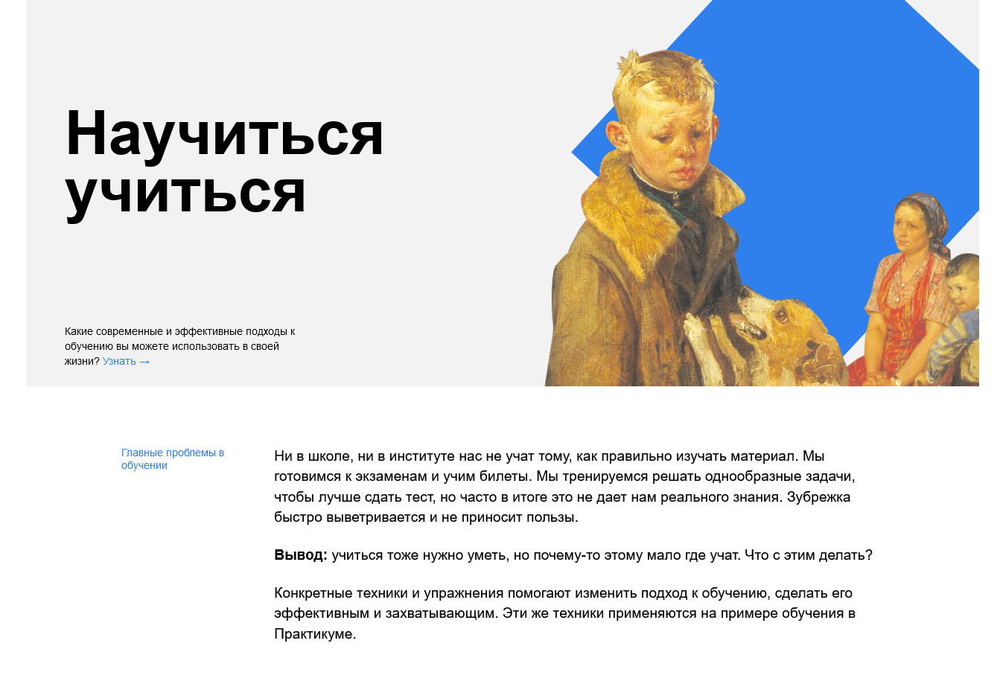

# Практическая работа: [Научиться учиться](https://github.com/Petr-Glotov/how-to-learn.git)

Описание проекта
--------------------

Вёрстка по готовому макету, вторая проектная работа из первого курса профессии **Веб-разработчик** от Яндекс.Практикум.

Разметка веб-страницы flex-контейнерами. В основном используется относительное позиционирование элементов. Точечно применяется абсолютное позиционирование отдельных элементов. Для двух элементов применяется анимация методами CSS.

Используемые технологии
-----------------------------------
* HTML;
* CSS;
* БЭМ (Nested);
* Git;

